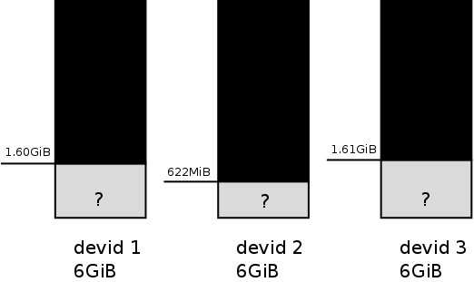
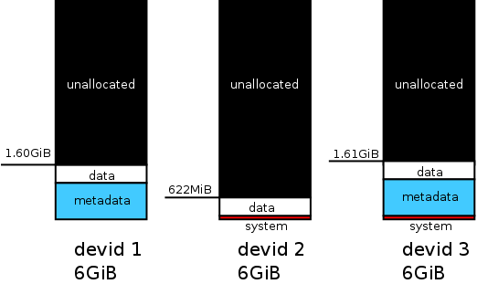

Previous: [Space Info](space_info.md)

Chunks and the physical and virtual address space
=================================================

In the previous page, we had a look at the space info, showing us which
combinations of type and profile (e.g. `DATA, single`) are present in our
filesystem. Even earlier, on the page about devices, we had a look at the
output of `btrfs fi show`. Let's look at them again:

```
-# btrfs fi show
Label: none  uuid: d9aa0273-023c-4d9e-8d93-a575140be799
    Total devices 3 FS bytes used 112.00KiB
    devid    1 size 6.00GiB used 1.60GiB path /dev/loop0
    devid    2 size 6.00GiB used 622.38MiB path /dev/loop1
    devid    3 size 6.00GiB used 1.61GiB path /dev/loop2

-# btrfs fi df /mnt/tutorial
Data, RAID0: total=1.80GiB, used=704.00KiB
System, RAID1: total=8.00MiB, used=16.00KiB
Metadata, RAID1: total=1.00GiB, used=112.00KiB
GlobalReserve, single: total=16.00MiB, used=0.00B
```

We can see that we have raw disk space allocated, and we can see how many
allocated raw disk space goes into a btrfs 'space', but, we still have no idea
how these two exactly map to each other. On what two devices is this `1.80GiB`
of data space allocated? Is it one big allocation, or does it consist of
multiple different ones, which can be on more than one device in total?

| Where's my data exactly? |
|:--:|
||

Chunks
------

Chunks are one of the core building blocks of btrfs storage. A 'chunk'
represents part of a 'space'. So, this `1.80GiB` `Data, RAID0` can consist of
one or multiple 'chunks', whose size add up to `1.80GiB`.

Let's have a look at the chunks in our test filesystem, before all of the above
brings us headaches and dizziness...

```
-# python3
>>> import btrfs
>>> fs = btrfs.FileSystem('/mnt/tutorial')
>>> for chunk in fs.chunks():
...     print(chunk)
...
chunk vaddr 20971520 type SYSTEM|RAID1 length 8388608 num_stripes 2
chunk vaddr 29360128 type METADATA|RAID1 length 1073741824 num_stripes 2
chunk vaddr 1103101952 type DATA|RAID0 length 1932656640 num_stripes 3
```

Aha! So, apparently, we just have three chunks in total. The type looks
familiar, but the chunk also has a few new attributes, like `vaddr` and
`num_stripes`...

So, there's apparently a chunk at address 20971520... But, what does that mean?
On which of the three drives is it at this address? Instead of getting answers,
we got more questions now...

The virtual address space
--------------------------------------

Traditionally, a filesystem would live on just one block device, and the space
used would directly map to any address within that single block device.

RAID solutions like mdraid, implemented in the device mapper layer of linux
change this, and combine multiple underlying devices into a single new block
device, which is presented to the user, hiding the complexity.

However, when creating btrfs it was chosen to not implement the mapping in this
way, but do it directly in btrfs. The filesystem itself has a virtual address
space, which is actually used for writing files and searching for data by the
rest of the kernel. This could be compared to addresses on the block device
that device mapper would present to you.

```
>>> for chunk in fs.chunks():
...     print("{} from {} to {}".format(
...              chunk.type_str,
...              btrfs.utils.pretty_size(chunk.vaddr),
...              btrfs.utils.pretty_size(chunk.vaddr + chunk.length)))
...
SYSTEM|RAID1 from 20.00MiB to 28.00MiB
METADATA|RAID1 from 28.00MiB to 1.03GiB
DATA|RAID0 from 1.03GiB to 2.83GiB
```

Apparently, the virtual address space starts at `20MiB`, and ends at `2.83GiB`.
But, we still don't know where the data is placed on the disks...

Also note that the btrfs virtual address space does not have to be contiguous.
New chunks are always added after the last one, and address space of removed
ones is never reused. Chunks are removed when they're completely empty, or for
example when using `btrfs balance`.

Stripes and the physical address space
--------------------------------------

Besides their address and length in the virtual address space, the chunks
information also provides us with stripe objects. These stripe objects tell us
where exactly in the physical address space the contents of this chunk are to
be stored:

```
>>> for chunk in fs.chunks():
...     print(chunk)
...     for stripe in chunk.stripes:
...         print("  {}".format(stripe))
...
chunk vaddr 20971520 type SYSTEM|RAID1 length 8388608 num_stripes 2
  stripe devid 3 offset 1048576
  stripe devid 2 offset 1048576
chunk vaddr 29360128 type METADATA|RAID1 length 1073741824 num_stripes 2
  stripe devid 1 offset 20971520
  stripe devid 3 offset 9437184
chunk vaddr 1103101952 type DATA|RAID0 length 1932656640 num_stripes 3
  stripe devid 2 offset 9437184
  stripe devid 1 offset 1094713344
  stripe devid 3 offset 1083179008
```

And finally, we get our answer. When combining the information we've looked up
so far, we can for example determine that data write to the `METADATA|RAID1`
chunk at virtual address `29360128` ends up being translated in two writes,
mirrored on physical device `1` and `3`.

Device extents
--------------

The btrfs metadata also keeps track of the reverse mapping, mapping physical
disk space on devices back to the chunk that owns this raw disk space. Those
metadata objects are called device extents:

```
>>> for dev_extent in fs.dev_extents():
...   print(dev_extent)
...
dev extent devid 1 paddr 20971520 length 1073741824 chunk 29360128
dev extent devid 1 paddr 1094713344 length 644218880 chunk 1103101952
dev extent devid 2 paddr 1048576 length 8388608 chunk 20971520
dev extent devid 2 paddr 9437184 length 644218880 chunk 1103101952
dev extent devid 3 paddr 1048576 length 8388608 chunk 20971520
dev extent devid 3 paddr 9437184 length 1073741824 chunk 29360128
dev extent devid 3 paddr 1083179008 length 644218880 chunk 1103101952
```

The full picture
----------------

| Where's my data exactly? |
|:--:|
||


Next: [Block Groups and Extents](block_groups.md)  
Up: [Overview](README.md)
